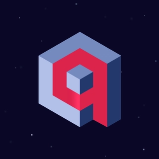

<h1 align="center">
  
</h1>

</a>

 

###  about me
-  Hi, I’m @Hamza-Sallam
- 👀 I’m work in AI and software dev 
- 📫 How to reach me ... 
- email: hamza.sallam.eng@outlook.com, website: [7amza.vercel.app](https://7amza.vercel.app)

# 💻 Tech Stack:

  
  

      
    

    
Python

  
  
  

      
    

    
Java

  
  
    

      
    

    
JavaScript

  
  
    

      
    

    
TypeScript

  
  
    
 
      
    

    
HTML

  
  
    

      
    

    
CSS

  
  
  

      
    

    
Node.js

  
  
    

      
    

    
Next.js

  
  
    

      
    

    
Git

  
  
  

      
    

    
Docker

  
  
    

      
    

    
PostgreSQL

  
  
    

      
    

    
NumPy

  
  
    

      
    

    
TensorFlow

  
  
    

      
    

    
LangChain

  
  
    

      
    

    
OpenAI

  
  
    

      
    

    
Ollama

  
  
    

      
    

    
Qdrant

  
  
    

      
    

    
FastAPI

  
  
    

      
    

    
ElevenLabs

  
  
    

      
    

    
Vapi

  
  
    

      
    

    
Hugging Face

  
  
    

      
    

    
Linux

  
  
    

      
    

    
MCP

  
  
    

      
    

    
n8n

  

 
  

  

  
# 
 
 

    

## 🏆 GitHub Trophies

### ✍️ Random Dev Quote

### 🔝 Top Contributed Repo

---

