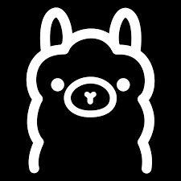

<h1 align="center">
  
</h1>

</a>

     

###  about me
-  Hi, I’m @Hamza-Sallam
- 👀 I’m work in AI and software dev 
- 📫 How to reach me ... 
- email: hamza.sallam.eng@outlook.com, website: [hamzasallam.online](https://hamzasallam.online)

# 💻 Tech Stack:

  
  
  
  
  
  
  
  
  
  
  
  
  
  
  
  
  
  
  
  
  
  
  
  

 
  

  

  
# 

 

    

## 🏆 GitHub Trophies

### ✍️ Random Dev Quote

### 🔝 Top Contributed Repo

---

